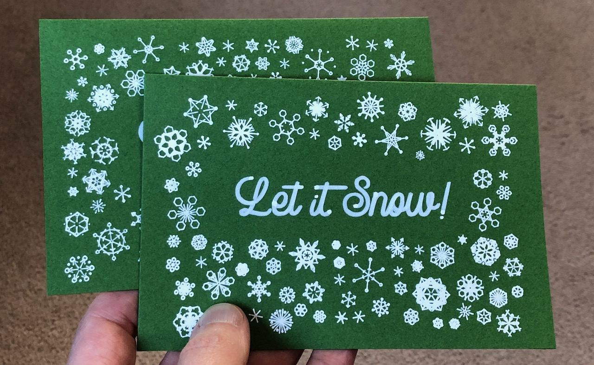

# snowflakes

Create generative art for pen plotters in Processing.

This software fills a canvas with dynamically generated snowflakes. SVG output is ready for printing or plotting.

## Getting Started

### Requirements

- [Processing 4](https://processing.org)

### Config

Edit the `config.pde` file to set the canvas size, pen width, and preview settings.

There are also vars here to control snowflake size and padding.

## Usage

When the sketch is started, it will use a circle-packing algorithm to fill the screen with dynamically generated snowflakes.

Press **`R`** to randomize all snowflake designs.

**Click** an individual flake to randomize the design for that specific flake.

### Key Commands

**`R`**: Re-randomize design for every snowflake on the canvas. This won't re-position the flakes. Restart the sketch to generate new flake positions.

**`D`**: Toggle debug drawing.

**`S`**: Save a plot-ready SVG.

### Mask Image

You can load a black and white mask image to indicate which areas of the canvas are available for snoflake placement (white), and which areas should be left blank (black).

To enable this, set `useMask` to `true` in `config.pde` and set the `maskImagePath` to the mask image you want to use.

## Support

This is a personal project and is mostly unsupported, but I'm happy to hear feedback or answer questions.

## License

This project is licensed under the Unlicense - see the [LICENSE](LICENSE) file for details.
